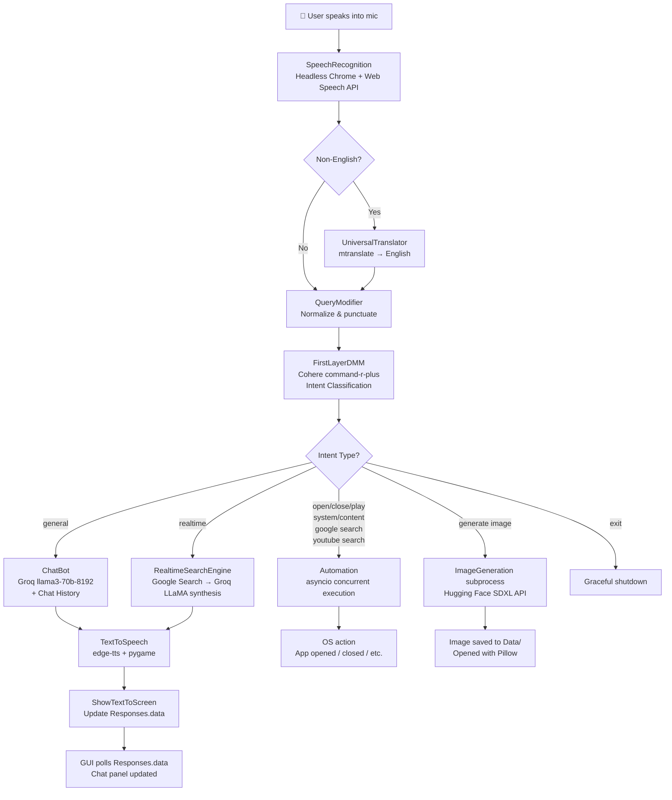
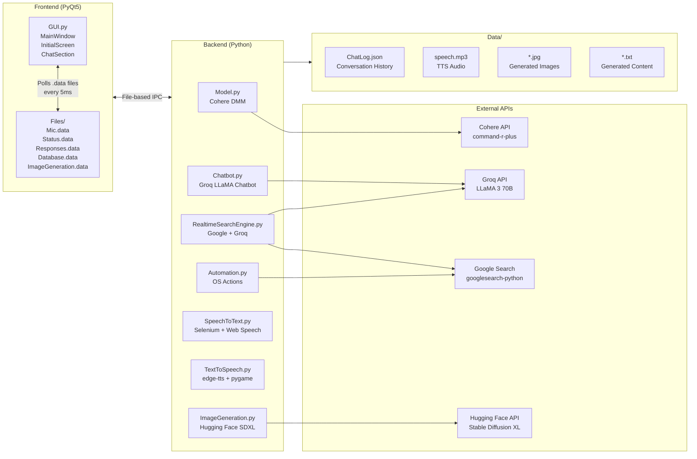

# Nemu AI Assistant

> **A voice-driven, multi-modal AI desktop assistant powered by Groq LLaMA, Cohere, and Hugging Face — capable of natural conversation, real-time web search, system automation, and AI image generation, all wrapped in a sleek PyQt5 GUI.**

---

## Table of Contents

- [Project Overview](#project-overview)
- [Features](#features)
- [How It Works](#how-it-works)
- [Architecture](#architecture)
- [Technology Stack](#technology-stack)
- [Project Structure](#project-structure)
- [Prerequisites](#prerequisites)
- [Installation](#installation)
- [Environment Variables](#environment-variables)
- [Running the Project](#running-the-project)
- [Usage](#usage)
- [UI / User Interface](#ui--user-interface)
- [Configuration](#configuration)
- [Available Scripts](#available-scripts)
- [Development Guide](#development-guide)
- [Troubleshooting](#troubleshooting)
- [Contributing](#contributing)
- [Project Status](#project-status)
- [License](#license)
- [Author](#author)

---

## Project Overview

**Nemu** is a fully local, voice-first AI desktop assistant for Windows. Inspired by virtual assistants like Jarvis, Nemu listens to your voice, understands your intent, and takes intelligent action — whether that means answering a question, searching the web in real time, opening applications, generating images, or writing content.

**The problem it solves:** Most AI assistants are either cloud-locked, text-only, or lack the ability to interact with the operating system. Nemu bridges that gap by combining conversational AI, real-time web knowledge, OS-level automation, and AI image generation into a single, self-contained desktop application.

**Target users:** Developers, students, and power users who want a programmable, customizable AI assistant running entirely on their own machine.

**Key value propositions:**
- **Voice-first**: Speak naturally; Nemu transcribes and understands you using the browser's Web Speech API via a headless Chrome session.
- **Intent routing**: A dedicated Cohere `command-r-plus` model categorizes every query before deciding how to handle it — no hardcoded keyword matching.
- **Persistent memory**: All conversation history is stored locally in `Data/ChatLog.json` and is loaded on every session.
- **OS automation**: Open/close apps, control system volume, search Google or YouTube, and write content — all by voice.
- **AI image generation**: Ask Nemu to generate an image; it calls Stable Diffusion XL via Hugging Face Inference API and opens the result automatically.
- **Custom GUI**: A frameless, dark-themed PyQt5 window with a glowing animated interface.

---

## Features

### 🎙️ Voice Input via Web Speech API
Nemu launches a headless Chrome browser (via Selenium) that uses the browser's built-in `webkitSpeechRecognition` API to capture your microphone. The transcribed text is extracted and passed to the backend. Non-English input is automatically translated to English via `mtranslate` before processing.

### 🧠 First-Layer Decision Model (Intent Classification)
Before any action is taken, every query passes through a Cohere `command-r-plus` model acting as a Decision-Making Model (DMM). It classifies the query into one of: `general`, `realtime`, `open`, `close`, `play`, `generate image`, `system`, `content`, `google search`, `youtube search`, `exit`. Multiple intents can be detected in a single utterance (e.g., "open Chrome and search YouTube for lo-fi music").

### 💬 Conversational AI Chatbot (Groq + LLaMA 3 70B)
General conversational queries are routed to Groq's `llama3-70b-8192` model. The full conversation history (from `Data/ChatLog.json`) is included with every request, giving Nemu contextual memory across sessions. Real-time date and time are injected into the system prompt automatically.

### 🌐 Real-Time Web Search Engine
Realtime queries trigger a two-step pipeline: first, `googlesearch-python` fetches the top 5 Google results (titles and descriptions). These results are then passed to Groq LLaMA as context, which synthesizes a clean, professional answer — giving Nemu up-to-date knowledge beyond its training cutoff.

### 🤖 OS Automation (Async)
Automation commands are dispatched concurrently using Python's `asyncio`. Supported actions:
- **Open app**: Uses `AppOpener` with fallback to Google search and direct link extraction via BeautifulSoup.
- **Close app**: Closes running applications by name.
- **Play song**: Opens a YouTube search for the requested song.
- **System control**: Mutes, unmutes, increases, or decreases system volume via keyboard key simulation.
- **Google / YouTube search**: Opens the browser directly to the search results.
- **Content writing**: Uses LLaMA 3 to generate written content (letters, essays, code, etc.) and saves it as a `.txt` file, then opens it in Notepad.

### 🖼️ AI Image Generation (Stable Diffusion XL)
Nemu can generate images from natural language prompts by calling the Hugging Face Inference API with the `stabilityai/stable-diffusion-xl-base-1.0` model. The generated image is saved to the `Data/` folder and automatically displayed. Image generation runs as a separate subprocess to avoid blocking the main assistant loop.

### 🔊 Text-to-Speech (Microsoft Edge TTS)
All assistant responses are spoken aloud using `edge-tts` (Microsoft's neural TTS engine), played back via `pygame`. If a response exceeds 4 sentences or 250 characters, only the first 2 sentences are spoken and the full text is shown on screen. The TTS voice is configurable via the `.env` file.

### 🖥️ Custom PyQt5 GUI
A frameless, frameless dark-themed desktop window with:
- Animated Jarvis-style GIF avatar.
- Glowing, animated microphone button (cyan when idle, red/pulsing when listening).
- Scrollable chat history panel.
- Navigation bar (Home / Chat views).
- Status label showing real-time assistant state (Listening, Thinking, Searching, Answering).
- Window drag, minimize, maximize, and close controls.

### 💾 Persistent Chat Log
All messages (user and assistant) are stored in `Data/ChatLog.json` in an OpenAI-compatible format (`role`/`content`). The chat is reloaded on startup and displayed in the GUI's chat panel. The log is also used as the conversation context window for all AI requests.

---

## How It Works



---

## Architecture



### Component Descriptions

| Component | Location | Responsibility |
|-----------|----------|----------------|
| **MainWindow / GUI** | `Frontend/GUI.py` | PyQt5 frameless window, renders all screens and UI elements |
| **InitialScreen** | `Frontend/GUI.py` | Home screen with animated GIF and glowing mic button |
| **ChatSection** | `Frontend/GUI.py` | Scrollable chat panel that polls `Responses.data` every 5ms |
| **CustomTopBar** | `Frontend/GUI.py` | Draggable title bar with nav buttons and window controls |
| **File-based IPC** | `Frontend/Files/` | Shared `.data` files used for inter-thread communication |
| **FirstLayerDMM** | `Backend/Model.py` | Cohere LLM that classifies user intent into action categories |
| **ChatBot** | `Backend/Chatbot.py` | Groq LLaMA chat with persistent history and real-time date injection |
| **RealtimeSearchEngine** | `Backend/RealtimeSearchEngine.py` | Google search scraper + Groq synthesis for up-to-date answers |
| **Automation** | `Backend/Automation.py` | Async execution of OS tasks (open/close apps, system controls, content writing) |
| **SpeechToText** | `Backend/SpeechToText.py` | Headless Chrome via Selenium using the Web Speech API for microphone input |
| **TextToSpeech** | `Backend/TextToSpeech.py` | Microsoft Edge neural TTS via `edge-tts`, played with `pygame` |
| **ImageGeneration** | `Backend/ImageGeneration.py` | Hugging Face Inference API for Stable Diffusion XL image generation |
| **ChatLog** | `Data/ChatLog.json` | Persistent conversation history in OpenAI message format |

---

## Technology Stack

| Category | Technology | Purpose |
|----------|------------|---------|
| **Language** | Python 3.10+ | Primary runtime for all backend and frontend code |
| **GUI** | PyQt5 | Frameless desktop window, animations, custom widgets |
| **LLM – Chat** | Groq API (`llama3-70b-8192`) | Conversational responses with persistent history |
| **LLM – Intent** | Cohere API (`command-r-plus`) | First-layer decision/intent classification model |
| **LLM – Search** | Groq API (`llama3-70b-8192`) | Synthesizes answers from real-time Google search results |
| **Image Generation** | Hugging Face Inference API (`stabilityai/stable-diffusion-xl-base-1.0`) | AI image generation from text prompts |
| **Speech-to-Text** | Web Speech API (via Selenium headless Chrome) | Browser-native microphone transcription |
| **Text-to-Speech** | Microsoft Edge TTS (`edge-tts`) | Neural voice synthesis |
| **Audio Playback** | pygame | Plays TTS-generated MP3 audio |
| **Web Scraping** | BeautifulSoup 4, googlesearch-python | Fetches and parses Google search results |
| **Browser Automation** | Selenium + webdriver-manager | Drives headless Chrome for speech recognition |
| **OS Automation** | AppOpener, keyboard, webbrowser, subprocess | Interacts with the operating system |
| **Translation** | mtranslate | Translates non-English voice input to English |
| **Image Handling** | Pillow | Opens and verifies generated images |
| **HTTP** | requests | API calls to Hugging Face and Google |
| **Config** | python-dotenv | Loads environment variables from `.env` |
| **Async** | asyncio | Concurrent execution of OS automation tasks |
| **UI Styling** | Rich | Colored terminal output for debugging |

---

## Project Structure

```text
Nemu AI Assistant/
│
├── main.py                        # Application entry point — orchestrates all threads
│
├── Backend/
│   ├── Model.py                   # Cohere-based intent classification (First Layer DMM)
│   ├── Chatbot.py                 # Groq LLaMA conversational AI with persistent history
│   ├── RealtimeSearchEngine.py    # Google search + Groq synthesis for real-time answers
│   ├── Automation.py              # Async OS automation (open/close apps, volume, content)
│   ├── SpeechToText.py            # Selenium headless Chrome + Web Speech API transcription
│   ├── ImageGeneration.py         # Hugging Face SDXL image generation subprocess
│   └── TextToSpeech.py            # Microsoft Edge TTS + pygame audio playback
│
├── Frontend/
│   ├── GUI.py                     # Full PyQt5 GUI — windows, widgets, animations
│   ├── Files/                     # File-based IPC between threads
│   │   ├── Mic.data               # Microphone toggle state ("True"/"False")
│   │   ├── Status.data            # Current assistant status label text
│   │   ├── Responses.data         # Latest message to display in chat panel
│   │   ├── Database.data          # Formatted full chat history for GUI rendering
│   │   └── ImageGeneration.data   # Image generation trigger and prompt
│   └── Graphics/                  # UI assets
│       ├── Jarvis.gif             # Animated GIF displayed in the GUI
│       └── *.png                  # Icon assets (mic, home, chat, window controls)
│
├── Data/
│   ├── ChatLog.json               # Persistent conversation history (OpenAI format)
│   ├── speech.mp3                 # Temporary TTS audio file (overwritten each response)
│   ├── Voice.html                 # Auto-generated HTML page for Web Speech API
│   └── *.jpg / *.txt              # Generated images and written content (auto-created)
│
├── Requirement.txt                # Python package dependencies
├── .env                           # Environment variables (NOT committed — see below)
└── .gitignore                     # Git ignore rules
```

---

## Prerequisites

Before running the project, ensure you have the following installed and ready:

- **Python 3.10 or higher** — required for `asyncio` features and type hints used in the code.
- **Google Chrome** — required for the Selenium-based speech recognition module (`SpeechToText.py`). ChromeDriver is downloaded automatically by `webdriver-manager`.
- **pip** — Python package manager.
- **API Keys** — you must obtain the following free API keys:
  - [Groq API Key](https://console.groq.com/) — for LLaMA 3 70B chat and search synthesis.
  - [Cohere API Key](https://dashboard.cohere.com/) — for intent classification (`command-r-plus`).
  - [Hugging Face API Key](https://huggingface.co/settings/tokens) — for Stable Diffusion XL image generation.

> [!IMPORTANT]
> A microphone must be connected and accessible on your system for voice input to work.

---

## Installation

### 1. Clone the Repository

```bash
git clone https://github.com/Aditya-londhe-77/Nemu-AI.git
cd "Nemu AI Assistant"
```

### 2. Create and Activate a Virtual Environment (Recommended)

```bash
python -m venv .venv

# Windows
.venv\Scripts\activate
```

### 3. Install Dependencies

```bash
pip install -r Requirement.txt
```

> [!NOTE]
> `webdriver-manager` will automatically download the correct ChromeDriver for your installed version of Google Chrome when the application first runs.

---

## Environment Variables

Create a `.env` file in the **root of the project** (the same directory as `main.py`).

```env
# Your display name — used to personalize the assistant's responses
Username=YourName

# The assistant's name shown in the UI and responses
Assistantname=Nemu

# API Keys
GroqAPIKey=your_groq_api_key_here
CohereAPIKey=your_cohere_api_key_here
HuggingFaceAPIKey=your_huggingface_api_key_here

# Language code for voice input (e.g., en-US, hi-IN)
# The assistant always responds in English regardless of input language
InputLanguage=en-US

# Microsoft Edge TTS voice name
# See available voices: https://learn.microsoft.com/en-us/azure/ai-services/speech-service/language-support
AssistantVoice=en-US-AriaNeural
```

| Variable | Description |
|----------|-------------|
| `Username` | Your name — shown in the UI and used to personalize responses |
| `Assistantname` | The name of the assistant (default: `Nemu`) |
| `GroqAPIKey` | Groq API key for LLaMA 3 70B (chat + search synthesis) |
| `CohereAPIKey` | Cohere API key for intent classification |
| `HuggingFaceAPIKey` | Hugging Face token for Stable Diffusion XL image generation |
| `InputLanguage` | BCP-47 language code for the Web Speech API (e.g., `en-US`, `hi-IN`) |
| `AssistantVoice` | Edge TTS voice name (e.g., `en-US-AriaNeural`, `en-US-GuyNeural`) |

> [!CAUTION]
> **Never commit your `.env` file.** It contains private API keys. The `.gitignore` file already excludes it.

---

## Running the Project

From the root directory of the project (with the virtual environment activated):

```bash
python main.py
```

This starts two threads simultaneously:
- **Thread 1** (`FirstThread`): The main logic loop — listens for mic activation, runs speech recognition, intent classification, and generates responses.
- **Thread 2** (`SecondThread` / main thread): Launches the PyQt5 GUI window.

The application will open full-screen. A headless Chrome window will launch briefly in the background to initialize the speech recognition engine.

---

## Usage

1. **Launch the application** by running `python main.py`.
2. **The Home screen** is displayed — you will see an animated GIF and a circular microphone button.
3. **Click the microphone button** (it turns red and pulses when active) to begin listening.
4. **Speak your query or command** clearly into your microphone.
5. Nemu processes your input:
   - The status label updates in real time: `Listening... → Thinking... → Searching... / Answering...`
   - Your spoken text appears in the chat panel.
   - The assistant's response appears below it.
6. **The response is spoken aloud** via text-to-speech. Long responses are truncated for speech, and the full text is shown on screen.
7. **Switch to the Chat view** using the `CHAT` button in the top bar to review the full conversation history.
8. **Click the microphone button again** to stop listening (it turns cyan when idle).

### Example Voice Commands

| What you say | What Nemu does |
|--------------|----------------|
| `"Who is the CEO of Tesla?"` | Real-time Google search + LLaMA answer |
| `"Open Spotify"` | Opens the Spotify app via AppOpener |
| `"Play Blinding Lights on YouTube"` | Opens YouTube search results in browser |
| `"Write an essay about climate change"` | Generates essay, saves to `Data/`, opens in Notepad |
| `"Generate image of a futuristic city at night"` | Calls Stable Diffusion XL, displays generated image |
| `"Volume up"` | Simulates the volume up keyboard key |
| `"Search Google for Python tutorials"` | Opens Google search in browser |
| `"What is the capital of France?"` | LLaMA conversational response |
| `"Goodbye"` / `"Bye"` | Gracefully exits the application |

---

## UI / User Interface

### Home Screen (`InitialScreen`)
- Displays the assistant's name and subtitle ("Your Intelligent Desktop Assistant") at the top.
- Features a large, glowing animated GIF (Jarvis-style visualization) as the central element.
- A **status label** below the GIF shows the current assistant state in cyan text.
- A **glowing mic button** (90×90 px circular button) toggles voice listening. It pulses red with an outer glow animation when actively listening.
- A hint label ("Tap the mic to start speaking") is shown at the bottom.

### Chat View (`MessageScreen` + `ChatSection`)
- A gradient accent line (cyan → purple → pink) runs across the top of the panel.
- A scrollable `QTextEdit` displays the full conversation history.
- Below the chat, a smaller animated GIF and status label provide feedback during interaction.
- A custom thin scrollbar with cyan-to-purple gradient styling replaces the default scrollbar.

### Custom Top Bar (`CustomTopBar`)
- Glassmorphism-styled header with a linear gradient background.
- Displays the assistant's name on the left.
- **HOME** and **CHAT** navigation buttons in the center.
- Minimize, maximize/restore, and close window controls on the right.
- The bar is **draggable** — click and drag to reposition the window.
- A cyan → purple → pink gradient accent line runs along the bottom edge of the top bar.

### Color Palette

| Color | Hex | Usage |
|-------|-----|-------|
| Background | `#0a0a12` | Main window background |
| Card | `#12121f` | Button backgrounds |
| Accent Cyan | `#00d4ff` | Primary accent, mic idle state, title |
| Accent Purple | `#7b2ff7` | Gradient midpoint |
| Accent Pink | `#ff2d95` | Gradient endpoint |
| Danger Red | `#ff4757` | Mic active state |
| Text Primary | `#e8eaf0` | Main chat text |
| Text Secondary | `#8890a4` | Subtitles, secondary labels |

---

## Configuration

| Setting | Location | Default | Description |
|---------|----------|---------|-------------|
| `Username` | `.env` | — | Personalizes assistant responses |
| `Assistantname` | `.env` | `Nemu` | Assistant name shown in UI |
| `GroqAPIKey` | `.env` | — | Required for LLaMA 3 chat/search |
| `CohereAPIKey` | `.env` | — | Required for intent classification |
| `HuggingFaceAPIKey` | `.env` | — | Required for image generation |
| `InputLanguage` | `.env` | `en-US` | Speech recognition language |
| `AssistantVoice` | `.env` | — | Edge TTS voice (e.g., `en-US-AriaNeural`) |
| TTS pitch | `TextToSpeech.py` | `+5Hz` | Pitch offset for Edge TTS |
| TTS rate | `TextToSpeech.py` | `+13%` | Speed offset for Edge TTS |
| Chat model | `Chatbot.py` | `llama3-70b-8192` | Groq model for conversation |
| Intent model | `Model.py` | `command-r-plus` | Cohere model for intent routing |
| Image model | `ImageGeneration.py` | `stabilityai/stable-diffusion-xl-base-1.0` | HF model for image generation |
| Google results | `RealtimeSearchEngine.py` | `5` | Number of Google results fetched |
| GUI refresh rate | `Frontend/GUI.py` | `5ms` | Chat panel polling interval |

---

## Available Scripts

| Command | Description |
|---------|-------------|
| `python main.py` | Start the full Nemu AI Assistant application |
| `python Backend/Model.py` | Test intent classification in isolation (interactive REPL) |
| `python Backend/Chatbot.py` | Test the conversational chatbot in isolation (interactive REPL) |
| `python Backend/RealtimeSearchEngine.py` | Test the real-time search engine in isolation |
| `python Backend/SpeechToText.py` | Test speech recognition in isolation (prints transcribed text) |
| `python Backend/TextToSpeech.py` | Test text-to-speech in isolation (prompts for text input) |
| `python Backend/ImageGeneration.py` | Run image generation process (monitors `ImageGeneration.data`) |
| `python Frontend/GUI.py` | Launch the GUI standalone (without backend logic) |

---

## Development Guide

### Where Things Are

| What you want to change | Where to look |
|-------------------------|---------------|
| Intent classification logic / prompt | [`Backend/Model.py`](Backend/Model.py) — `preamble` variable and `FirstLayerDMM()` function |
| Chatbot personality / system prompt | [`Backend/Chatbot.py`](Backend/Chatbot.py) — `System` variable |
| Add new automation commands | [`Backend/Automation.py`](Backend/Automation.py) — `TranslateAndExecute()` async generator |
| Change LLM model | [`Backend/Chatbot.py`](Backend/Chatbot.py) or [`Backend/RealtimeSearchEngine.py`](Backend/RealtimeSearchEngine.py) — `model=` parameter |
| Change TTS voice / speed / pitch | [`Backend/TextToSpeech.py`](Backend/TextToSpeech.py) — `TextToAudioFile()` or `.env` `AssistantVoice` |
| Speech recognition language | `.env` — `InputLanguage` |
| Image generation model | [`Backend/ImageGeneration.py`](Backend/ImageGeneration.py) — `API_URL` constant |
| GUI colors / styling | [`Frontend/GUI.py`](Frontend/GUI.py) — `COLORS` dictionary and `STYLESHEET` |
| Add new GUI screens | [`Frontend/GUI.py`](Frontend/GUI.py) — Add widget to `QStackedWidget` in `MainWindow.initUI()` |
| Main execution loop | [`main.py`](main.py) — `MainExecution()` and `FirstThread()` |

### File-Based IPC Pattern
The GUI and backend communicate through small text files in `Frontend/Files/`. The GUI polls these files every 5ms using a `QTimer`. When the backend writes a new response to `Responses.data`, the GUI detects the change and updates the chat panel. This decoupled approach allows the backend logic to run in a separate thread without any Qt event loop concerns.

### Adding a New Automation Action
1. Add the action name to the `funcs` list in [`Backend/Model.py`](Backend/Model.py) and update `preamble` with instructions.
2. Add the corresponding action name to the `Functions` list in [`main.py`](main.py).
3. Implement the function in [`Backend/Automation.py`](Backend/Automation.py) and add a new `elif` branch in `TranslateAndExecute()`.

---

## Troubleshooting

### `ModuleNotFoundError` on startup
Ensure the virtual environment is activated and all dependencies are installed:
```bash
.venv\Scripts\activate
pip install -r Requirement.txt
```

### Speech recognition not working / Chrome errors
- Ensure **Google Chrome is installed** on your system.
- `webdriver-manager` downloads ChromeDriver automatically on the first run — ensure you have internet access.
- If Chrome version mismatches occur, update Chrome or clear the webdriver-manager cache:
  ```bash
  pip install --upgrade webdriver-manager
  ```

### `KeyError` or missing `.env` values
Ensure your `.env` file exists in the project root and contains all required keys (`Username`, `Assistantname`, `GroqAPIKey`, `CohereAPIKey`, `HuggingFaceAPIKey`, `InputLanguage`, `AssistantVoice`).

### No audio output (TTS silent)
- Verify your system audio is not muted.
- Check that `AssistantVoice` in `.env` is a valid Edge TTS voice name.
- Ensure `pygame` installed correctly: `pip install pygame`.

### Image generation fails
- Verify `HuggingFaceAPIKey` is set and valid.
- The Hugging Face Inference API for SDXL may be slow or rate-limited on free tiers. Check [status.huggingface.co](https://status.huggingface.co).

### GUI does not open or crashes immediately
- Ensure PyQt5 is installed: `pip install PyQt5`.
- Verify that all files under `Frontend/Graphics/` exist (especially `Jarvis.gif`).

### Port conflicts
Nemu does not bind to any network ports. No port conflicts should occur.

### `ChatLog.json` causing errors
If the chat log becomes corrupted, delete or clear it:
```bash
echo [] > Data\ChatLog.json
```

---

## Contributing

Contributions are welcome. To contribute:

1. **Fork** the repository on GitHub.
2. **Create a feature branch** from `main`:
   ```bash
   git checkout -b feature/your-feature-name
   ```
3. **Make your changes** — backend, frontend, or documentation.
4. **Test your changes** by running `python main.py` and exercising the affected features.
5. **Commit your changes** with a clear, descriptive message:
   ```bash
   git commit -m "feat: add reminder automation command"
   ```
6. **Push the branch** to your fork:
   ```bash
   git push origin feature/your-feature-name
   ```
7. **Open a Pull Request** on the original repository with a description of your changes.

> [!NOTE]
> Never commit your `.env` file or any API keys. Ensure all secrets remain local.

---

## Project Status

**🟡 Active Development** — The core assistant functionality is fully implemented and working. The project is under active development with ongoing improvements to features, UI polish, and reliability.

---

## License

No license is currently specified for this project. All rights are reserved by the author unless otherwise stated.

---

## Author

**Aditya Londhe**
- GitHub: [Aditya-londhe-77](https://github.com/Aditya-londhe-77)
- Project: [Nemu-AI](https://github.com/Aditya-londhe-77/Nemu-AI)
